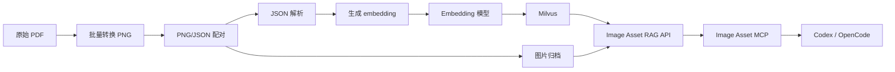

# 工作周报：图片资产检索与原理图入库

> 项目：Image Asset RAG / Image Asset MCP

## 一、核心成果

| 方向                   | 状态  | 关键产出                                                 |
| -------------------- | --- | ---------------------------------------------------- |
| Image Asset MCP 服务开发 | ✅   | 开发 `image-asset-mcp`，暴露统一图片检索工具 `image_asset_search` |
| 原理图数据批量处理            | ✅   | PDF→PNG（121张）+ JSON 配对（121份）                         |
| 原理图入库                | ✅   | 批量解析、归档、向量生成、Milvus 入库                               |
| 检索返回                 | ✅   | 包含图片 URL、标题、摘要、相似度、模块编号、元数据路径                        |

**数据统计：**
- `data/incoming/schematic`：121 组 PNG/JSON 配对数据
- `data/manifests/ingest_manifest.jsonl`：121 条成功入库记录
- 图片：`data/assets/schematic/{模块编号}/p001.png`
- 元数据：`data/metadata/schematic/{模块编号}/asset.json`

---

## 二、Image Asset MCP 服务开发

### 1.1 功能设计

封装 Image Asset RAG 的 `/search` 接口，为 Codex、OpenCode 提供图片资产检索能力。

| 工具 | 描述 |
|------|------|
| `image_asset_search` | 搜索图片资产库，返回标题、摘要、相似度、图片 URL、元数据等 |

**支持参数**：
| 参数 | 说明 | 默认 |
|------|------|------|
| `query` | 检索文本（必填） | - |
| `top_k` | 返回结果数（1~100） | 5 |
| `asset_type` | 资产类型过滤（如 `schematic`） | null |
| `latest_only` | 只返回最新版本 | true |
| `score_threshold` | 最低相似度阈值 | null |

### 1.2 技术方案

- **语言**：Node.js + TypeScript
- **协议**：MCP（Model Context Protocol）
- **传输**：stdio（便于 Codex、OpenCode 本地调用）
- **后端**：FastAPI `/search`
- **校验**：Zod 类型校验
- **超时**：60秒

### 1.3 安装与启动

```bash
# 安装依赖
npm install

# 自动配置 Codex/OpenCode 并注册 MCP
node scripts/install.cjs --api-base http://YOUR_HOST:8020

# 启动服务
IMAGE_RAG_API_BASE_URL=http://localhost:8020 npm start
```

返回字段：`score`、`asset_id`、`asset_type`、`source_id`、`title`、`summary`、`category`、`image_url`、`metadata_path`。

---

## 三、原理图数据处理流程

```
原始 PDF → 批量转 PNG → PNG/JSON 配对 → JSON 解析 → 生成 embedding → Milvus 入库 → 归档
```

| 环节 | 结果 |
|------|------|
| PDF → PNG | 121 张 PNG |
| JSON 配对 | 121 份 JSON |
| 图片归档 | `data/assets/schematic/` |
| 元数据归档 | `data/metadata/schematic/` |

JSON 采用 `module_rag_card.v1` 格式，支持功能描述、元件、网络、关键词检索。通过哈希去重避免重复入库。

---

## 四、检索链路



**效果**：输入查询（如“LED PWM 调光方案”）→ 向量化检索 → 返回模块编号、标题、摘要、图片 URL → 渲染原理图。

---

## 五、下一步计划

| 任务 | 说明 |
|------|------|
| MCP 联调验证 | Codex/OpenCode 中注册、启动、查询验证 |
| 检索效果评估 | 建立正负样本，评估 Top-K 召回，校准阈值 |
| 数据质量检查 | PNG/JSON 配对完整性、JSON 编码、模块编号唯一性 |