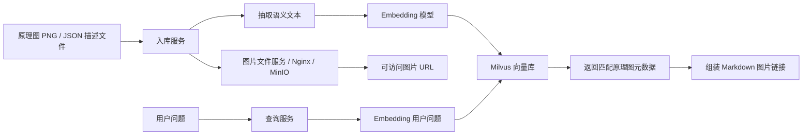

---
## 一、项目进展概览

### 核心成果

| 方向        | 状态      | 关键产出                    |
| --------- | ------- | ----------------------- |
| 上下文压缩插件   | ✅ 完成    | WebUI 长对话 Token 节省 60%+ |
| 知识库图片召回方案 | 🔄 设计完成 | 已完成技术选型                 |

### 1. Async Context Compression 插件

针对 WebUI 平台开发的长对话上下文压缩插件，现已上线稳定运行。

#### 核心技术实现

**① 三级 Token 估算优化**

- **Fast 估算**：`_estimate_text_tokens()` ~0.01ms，误差±15%
- **Cached**：`@lru_cache`，O(1) 查表返回
- **Precise**：`tiktoken.o200k_base` ~0.1ms

设计效果：~80% 的场景只用 Fast 路径就能判断 Token 远低于阈值

**② 系统消息绝对保护**

三层保护确保 LLM 行为指令永不丢失：
- `keep_first` 只计数非系统消息 → 自动保留
- Gap 系统消息提取 → 以原始消息形式保留
- 强制裁剪兜底 → 提取并重新插入

**③ 原生工具输出裁剪**

- 工具输出字符数 > 600 则裁剪
- 替换为 `[Content collapsed]`，标记 `is_trimmed = True`

**④ 异步摘要生成 — 永不阻塞用户**

```
用户请求 → Inlet(~1ms) → LLM → 返回用户 → 后台 asyncio.create_task()
                              → Token 计算 → 生成摘要 → 保存数据库
```

**⑤ 摘要 Prompt 工程**

XML 结构化输出，包含 9 个预定义章节：

```xml
<working_memory>
  <current_goal>...</current_goal>
  <user_preferences>...</user_preferences>
  <persistent_context>...</persistent_context>
  <recent_progress>...</recent_progress>
  <tool_state>...</tool_state>
  <errors_and_warnings>...</errors_and_warnings>
  <open_loops>...</open_loops>
  <next_reply_guidance>...</next_reply_guidance>
</working_memory>
```
![[file-20260701212256165.png]]

---
![[file-20260630224245064.png|736]]
![[file-20260630224321867.png]]
### 2. 知识库图片召回方案

针对现有知识库无法召回图片的问题，设计了一套完善的技术方案。

#### 问题背景

当前知识库只能检索文本 chunk，无法返回对应的图片、截图、图纸。用户询问"查电芯装配流程图"时，只能返回文字描述，无法看到实际图片。

#### 统一方案：分类处理策略

为不同数据源采用最适合的处理方案，实现图片的精准召回。

| 数据源类型 | 采用方案 | 核心思路 |
| -------- | ------- | --------|
| **PDF / 文档类** | 方案一：文本检索 + 页面截图 | 复用现有文本检索，根据命中结果返回对应页面截图 |
| **纯图片** | 方案二：Caption 转文本检索 | 把图片转成文字描述（caption），写入知识库，检索时返回图片 |

---

#### 方案一：文本检索 + 页面截图返回（针对 PDF / 文档）

**特点**：复用现有文本检索，根据命中结果返回对应页面截图。
**适用场景**：PDF、SOP文档、技术图纸等有文本内容的文档。

**架构**：


**返回格式**：
```json
{
  "results": [
    {
      "result_type": "text_with_page_image",
      "score": 0.83,
      "doc_name": "电芯装配SOP.pdf",
      "page_no": 7,
      "content": "电芯装配流程包括上料、扫码、焊接...",
      "page_image_url": "http://10.1.120.36:5010/pdf_pages/doc123/page_0007.png",
      "neighbor_page_image_urls": [
        "http://10.1.120.36:5010/pdf_pages/doc123/page_0006.png",
        "http://10.1.120.36:5010/pdf_pages/doc123/page_0007.png",
        "http://10.1.120.36:5010/pdf_pages/doc123/page_0008.png"
      ]
    }
  ]
}
```

**渲染示例**：
![[file-20260701224330442.png]]

---

#### 方案二：OCR/Caption 转文本检索（针对纯图片）

**特点**：把图片转成文字描述（caption），写入原有文本知识库，检索 caption 时返回对应图片 URL。
**适用场景**：独立的图片文件、照片、截图等没有文本来源的纯图片。

**架构**：
```
图片 / 页面截图
  → 保存到静态文件服务（得到 image_url）
  → VLM 生成 caption / OCR 提取文字
  → caption 做文本 embedding![[file-20260701224330442.png]]
  → caption + image_url + doc_id + page_no 一起写入 Milvus
  → 用 /search/dify 检索 caption，返回时带上 image_url
```

**核心原则**：图片 URL 在入库时生成，而不是检索时凭空得到的

**Milvus Schema**：
```python
{
  "id": "doc123_p0007_img0001",
  "content": "这是一张电芯装配流程图，展示上料、扫码、焊接、检测、下料等步骤。",
  "embedding": [0.01, 0.02, "..."],
  "image_url": "/kb-images/doc123/doc123_p0007_img0001.png",
  "doc_address": "/pdf/doc123.pdf",
  "doc_name": "电芯装配SOP.pdf",
  "doc_id": "doc123",
  "page_no": 7,
  "category": "流程图",
  "content_type": "image_caption"
}
```


---

## 三、下一步计划

* 方案一（PDF/文档类）落地

| 任务       | 说明                                                        |
| -------- | --------------------------------------------------------- |
| **图片收集** | 从现有 PDF 文档中提取页面截图，建立图片资源池                                 |
| **图片处理** | 标准化图片格式、命名规则，存储到静态文件服务                                    |
| **入库编码** | 将页面元数据（doc_id、page_no、image_url）与文本向量一并写入 Milvus          |
| **检索增强** | 修改查询服务，支持返回 `page_image_url` 和 `neighbor_page_image_urls` |

* 方案二（纯图片）原型

| 任务 | 说明 |
|------|------|
| **图片收集** | 收集 SOP 图片、照片、截图等独立图片文件 |
| **Caption 生成** | 调用 VLM 生成图片描述，或使用 OCR 提取文字 |
| **入库编码** | caption + image_url 写入 Milvus，构建图片向量索引 |
| **效果验证** | 测试 caption 质量与检索召回率，评估覆盖场景 |
